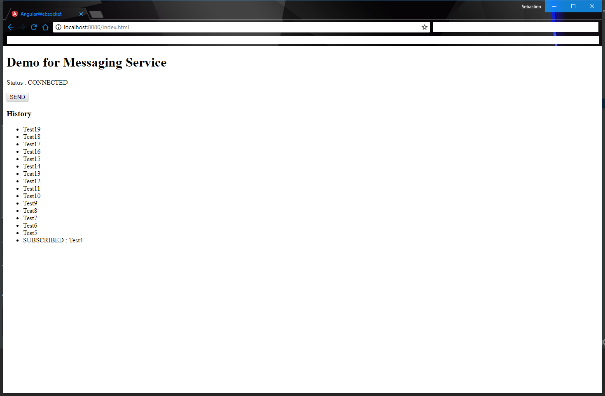

# Spring WebSocket Angular6

The purpose of this project is to present a full example of notification/messaging service between an angular6 client and a spring application.
There are many examples of clients using SockJS but with javascript directly and not angular ([Examples](http://www.baeldung.com/websockets-spring)).

This project is based on [ng2-stompjs](https://github.com/stomp-js/ng2-stompjs) (Please consult its great documentation). 
But it aim to provide a complete and minimalist project to serve as plug'n'play project for both *__frontend__* and *__backend__*.

## Usage
1. Clone the repository `git clone https://github.com/batiwo/spring-websocket-angular6.git` 
2. Build the `angular-websocket` project with `npm install` to install dependencies and then `ng build`
3. Build the `spring-websocket` project with `mvn install`
4. Run the produced JAR `spring-websocket-1.0-SNAPSHOT.jar` with `java -jar spring-websocket-1.0-SNAPSHOT.jar`
5. Go to [http://localhost:8080/index.html](http://localhost:8080/index.html) and enjoy.


 

## How to
### Spring Server
The spring server is a basic spring-boot api with the `spring-websocket` dependency.

#### A Simple Configuration
```xml
<dependency>
    <groupId>org.springframework.boot</groupId>
    <artifactId>spring-boot-starter-websocket</artifactId>
</dependency>
```

The WebSocketConfiguration is also minimalist.
We just configure the MessageBroker with an Endpoint and setAllowedOrigins to anyone.
The Endpoint "/socket" means that you will connect to the [ws://server-url/socket](ws://server-url/socket) with your clients.
```java
@Configuration
@EnableWebSocketMessageBroker
@EnableScheduling
public class WebSocketConfiguration implements WebSocketMessageBrokerConfigurer {

    @Override
    public void registerStompEndpoints(StompEndpointRegistry registry) {
        registry.addEndpoint("/socket").setAllowedOrigins("*");
    }
}
```

Notice that we do not use `withSockJS()`
```java 
registry.addEndpoint("/socket").setAllowedOrigins("*").withSockJS();
```

#### A Simple Controller
A method that is called when a message is sent from the client (angular) to the server (spring)
```java 
@MessageMapping(RECEIVING_URL)
public void onReceivedMessage(String message) {
    System.out.println("New message received : " + message);
}
```

A method called each 1000ms that send a string message
```java 
@Scheduled(fixedRate = 1000)
public void sendMessage() {
    template.convertAndSend(SENDING_URL, buildNextMessage());
}
```


An optional but interesting method that send a message just after the client subscribed (or re-subscribed) 
```java 
@SubscribeMapping(SENDING_URL)
public String onSubscribe() {
    return "SUBSCRIBED : " + message;
}
```


### Angular Client
#### Step to re-create the angular client :
##### Prerequisites
1. Create a new angular application `ng new angular-websocket`
2. Install required dependencies `npm install @stomp/ng2-stompjs` and `npm install @rxjs-compat`
3. Create a service `ng g service services/messaging`
4. Then develop the application code.

##### Sample explanation
Here is some useful `import`
```js
import { StompService, StompConfig, StompState } from "@stomp/ng2-stompjs";
import { Message } from "@stomp/stompjs";
import { Observable, BehaviorSubject } from "rxjs";
```

Create Stomp Configuration
```js
let stompConfig: StompConfig = {
  url: socketUrl,
  headers: {
    login: "",
    passcode: ""
  },
  heartbeat_in: 0,
  heartbeat_out: 20000,
  reconnect_delay: 5000,
  debug: true
};
```

Create Stomp Service
```js
this.stompService = new StompService(stompConfig);
```

Connect to a Stream
```js
this.stompService.subscribe(streamUrl);
```

Send a message from client (angular) to the server (spring)
```js
this.stompService.publish(url, JSON.stringify(message));
```

Monitor the state `this.stompService.state`

## Contributor
[Sébastien DRUJONT](https://github.com/batiwo)
